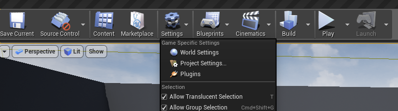
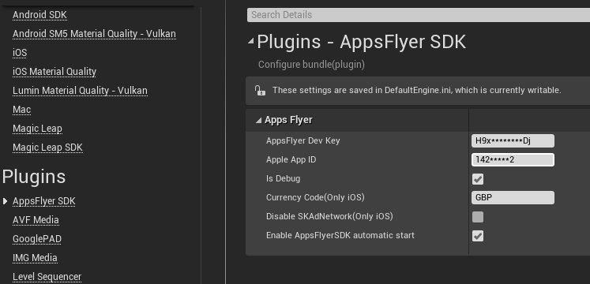
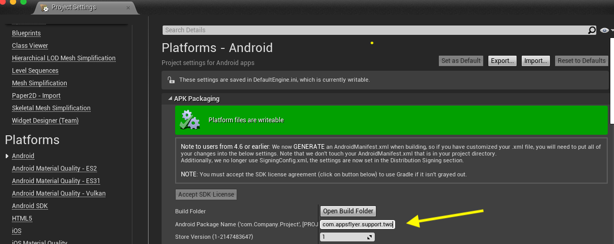

# Unreal AppsFlyer Plugin

v6.5.2

🛠 In order for us to provide optimal support, we would kindly ask you to submit any issues to support@appsflyer.com

*When submitting an issue please specify your AppsFlyer sign-up (account) email , your app ID , reproduction steps, code snippets, logs, and any additional relevant information.*

## Table of content

- [SDK versions](#plugin-build-for)
- [Installation](#installation)
- [Setup](#setup)
- [Guides & API](/docs/Guides.md)
  - [Init SDK](/docs/Guides.md#init-sdk)
  - [Start](/docs/Guides.md#start)
  - [Log Event](/docs/Guides.md#inappevent)
  - [Get AppsFlyerUID](/docs/Guides.md#appsflyeruid)
  - [Set Custom User Id](/docs/Guides.md#customid)
  - [Uninstall tracking](/docs/Guides.md#uninstall)
  - [Set Additional Data](/docs/Guides.md#setAdditionalData)
  - [DeepLinking](/docs/Guides.md#deeplinking)
- [Demo](#demo)  


### <a id="plugin-build-for"> This plugin is built for

- iOS AppsFlyerSDK **v6.5.2**
- Android AppsFlyerSDK **v6.5.2**


## <a id="installation">📲Installation

* In your game’s root directory, create a folder named Plugins
* Copy the AppsFlyer folder into it. You should have something like
```
  MyProject
  ├── Plugins
          └── AppsFlyerSDK
              └── AppsFlyerSDK.uplugin
```

## <a id="setup"> 🚀 Setup

First open Settings > Project Setting... and locate AppsFlyer under the Plugins section.




####  Set your App_ID (iOS only), Dev_Key and enable AppsFlyer to detect installations, sessions (app opens) and updates.  
> This is the minimum requirement to start tracking your app installs and is already implemented in this plugin. You **MUST** modify this call and provide:  
**AppsFlyer Dev Key** - Your application devKey provided by AppsFlyer.<br>
**Apple App ID**  - ***For iOS only.*** Your iTunes Application ID.<br>
**Is Debug** - When enabled the AppsFlyer SDK debug logs will be printed (development only!)



Once your dev key and app_id is set you are ready to use AppsFlyer! 

You will also need to make sure your package name is set up with a AppsFlyer Dashboard.




## <a id="demo"> 📱 Demo

Check out the demo for this project [here](https://github.com/AppsFlyerSDK/appsflyer-unreal-plugin/tree/master/Demo).
