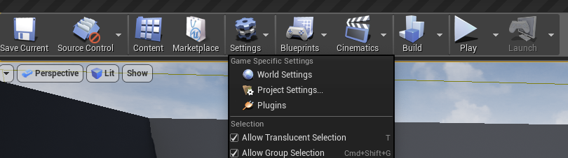

# <a id="setup"> 🚀 Setup

First open Settings > Project Setting... and locate AppsFlyer under the Plugins section.

####  Set your App_ID (iOS only), Dev_Key and enable AppsFlyer to detect installations, sessions (app opens) and updates.  
> This is the minimum requirement to start tracking your app installs and is already implemented in this plugin. You **MUST** modify this call and provide:  
**AppsFlyer Dev Key** - Your application devKey provided by AppsFlyer. 
**Apple App ID**  - ***For iOS only.*** Your iTunes Application ID. 
**Is Debug** - When enabled the AppsFlyer SDK debug logs will be printed (development only!)

Once your dev key and app_id is set you are ready to use AppsFlyer! 

You will also need to make sure your package name is set up with a AppsFlyer Dashboard.

