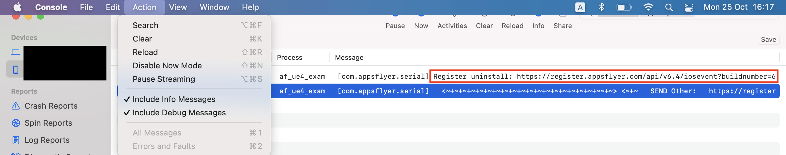

# Unreal Engine 4 AppsFlyer Plugin Guides


## Table of content

- [Init SDK](#init-sdk)
- [Start](#start)
- [Log Event](#inappevent)
- [Get AppsFlyerUID](#appsflyeruid)
- [Set Custom User Id](#customid)
- [Uninstall tracking](#uninstall)
    - [iOS Uninstall](#iOSUninstall)
    - [Android Uninstall](#androidUninstall)
- [Set Additional Data](#setAdditionalData)
- [DeepLinking](#deeplinking)
    - [Deferred Deep Linking (Get Conversion Data)](#deferred-deep-linking)
    - [Direct Deeplinking](#handle-deeplinking)
    - [Android Deeplink Setup](#android-deeplink)
    - [iOS Deeplink Setup](#ios-deeplink)
- [Demo](#demo)

##  <a id="init-sdk"> Init SDK
    


* **Dev key** - Found under App Settings in your AppsFlyer Dashboard.
* **App id** - app id from the itunes store (without the 'id' prefix)
* **Is debug** - Used to dub to AppsFlyer SDK. (Development Only!). Once this is set up the AppsFlyer SDK can log all Installs and Sessions.

* **Currency Code (only iOS)** - Defines the app currency method

* **Disable SKAdNetwork(Only iOS)** - Disable SKAdNetwork sessions

* **Automatically start the AppsFlyer SDK** - When set to true, the SDK will be sending a session automatically (before Blueprint events). If set to false, it's the developer responsability to call the start API from the Blueprint.

##  <a id="start"> Start

* Starts the SDK by sending the session to the server.

* As a default, the start method is being called automatically once the app is being launch.

* If needed, this setting can be disabled in the Plugin settings, and the developer can call the start method under the blueprint. When doing so, the SDK will send a session on every background-foreground transition.


##  <a id="inappevent"> Log Event
    
    
- In-app events help you track how loyal users discover your app, and attribute them to specific 
campaigns/media-sources. Please take the time define the event/s you want to measure to allow you 
to track ROI (Return on Investment) and LTV (Lifetime Value).
- The `logEvent` method allows you to send in-app events to AppsFlyer analytics. This method allows you to add events dynamically by adding them directly to the application code.
    
    


For more on in-app events check out the AppsFlyer **Knowledge base** [here](https://support.appsflyer.com/hc/en-us/articles/115005544169-AppsFlyer-Rich-In-App-Events-Android-and-iOS#Introduction).

##  <a id="appsflyeruid"> Get AppsFlyerUID

To receive unique AppsFlyer ID per app installation you can use this blueprint:


##  <a id="customid"> Set Custom User ID
    
Setting your own Custom ID enables you to cross-reference your own unique ID with AppsFlyer’s user ID and the other devices’ IDs. This ID is available in AppsFlyer CSV reports along with postbacks APIs for cross-referencing with you internal IDs.


**IMPORTANT**: In order for the user ID to be define in the first SDK session, please follow these steps:

1. Set the `Automatically start the AppsFlyer SDK` flag under the plugin setting to false.


2. Call the `Set Custom User ID` API before the call to the `Start` API under the Blueprint:

##  <a id="uninstall"> Uninstall
    
AppsFlyer uses silent push notifications, once a day, to verify if an app is still installed on a given device. If there is no response, an uninstall is recorded, and it's attributed to the media source that originally brought the user.

First, make sure to read the relevant information regarding [uninstall feature in the AppsFlyer dashboard](https://support.appsflyer.com/hc/en-us/articles/210289286-Uninstall-measurement)

<a id="iOSUninstall">**iOS**

**Important!**

1.  To support remote notification in IOS follow the [official unreal docs](https://docs.unrealengine.com/4.27/en-US/SharingAndReleasing/Mobile/LocalNotifications).

Don't forget to [download, compile and run Unreal Engine from the source](https://docs.unrealengine.com/4.27/en-US/ProgrammingAndScripting/ProgrammingWithCPP/DownloadingSourceCode) .


Find more information in the 


2. After the Unreal engine is running, open the Unreal IDE and go to settings > platforms -> iOS -> enable the remote notification support checkbox.


3. Under the setting -> Maps & Mods -> Game instance -> change the instance class to PlatformGameInstance


4. Configure the nodes under the relevant blueprint:


- **Register for remote notification** Will show a pop-up to the user from the OS, asking permission for remote notification

- **Application registered for remote notifications delegate** call AppsFlyer uninstall API from [iOS lifecycle](https://support.appsflyer.com/hc/en-us/articles/360017822118-Integrate-Android-uninstall-measurement-into-an-app)

- **AppsFlyerSDK remote notification token**  call AppsFlyer API for sending the token.


5. To debug enable AppsFlyer debug logs and check for the Register endpoint

    


<a id="androidUninstall">**Android**

For Android make sure to complete the steps in the [following article](https://support.appsflyer.com/hc/en-us/articles/360017822118-Integrate-Android-uninstall-measurement-into-an-app)

1. Configure [Firebase cloud messaging](https://support.appsflyer.com/hc/en-us/articles/360017822118-Integrate-Android-uninstall-measurement-into-an-app#http-v1)

2. Follow the steps to [integrate into the app](https://support.appsflyer.com/hc/en-us/articles/360017822118-Integrate-Android-uninstall-measurement-into-an-app#integrate-fcm-into-the-app)

3. Make sure to use appsFlyer.FirebaseMessagingServiceListener service, embedded in the SDK. This extends the FirebaseFirebaseMessagingService class, used to receive the FCM Device Token:

```xml
<application
   <!-- ... -->
      <service
        android:name="com.appsflyer.FirebaseMessagingServiceListener">
        <intent-filter>
          <action android:name="com.google.firebase.MESSAGING_EVENT"/>
        </intent-filter>
      </service>
   <!-- ... -->
</application>
```

4. Same nodes could be used (as in iOS) for Android under the relevant blueprint (no API call needed).
 


##  <a id="setAdditionalData"> Set Additional Data
    
Use to add custom key-value pairs to the payload of each event, including installs. These values will appear in raw-data reports.


**IMPORTANT** In order for the additional data to be included in the first SDK session, please follow these steps: 

1. Set the `Automatically start the AppsFlyer SDK` under the plugin setting to false.


2. Call the `setAdditionalData` API before the call to the `Start` API:


##  <a id="deeplinking"> Deep Linking
    


#### The 2 Deep Linking Types:
Since users may or may not have the mobile app installed, there are 2 types of deep linking:

1. _Deferred Deep Linking_ - Serving personalized content to new or former users, directly after the installation. 
2. _Direct Deep Linking_ - Directly serving personalized content to existing users, which already have the mobile app installed.

For more info please check out the [OneLink™ Deep Linking Guide](https://support.appsflyer.com/hc/en-us/articles/208874366-OneLink-Deep-Linking-Guide#Intro).

The set up for _deferred deep linking_ and _direct deeplinking_ is the same for UE4:

1. Create a new _Actor_ object.


2. Click _Add Component_ and and the **AppsFlyer SDKCallback** Component.


3. You can now add the required callbacks.


Now you are ready to implement Deeplinking!

###  <a id="deferred-deep-linking"> 1. Deferred Deep Linking (Get Conversion Data)

Check out the deferred deeplinkg guide from the AppFlyer knowledge base [here](https://support.appsflyer.com/hc/en-us/articles/207032096-Accessing-AppsFlyer-Attribution-Conversion-Data-from-the-SDK-Deferred-Deeplinking-#Introduction)

Code Sample to handle the conversion data:


###  <a id="handle-deeplinking"> 2. Direct Deeplinking
    
When a deeplink is clicked on the device the AppsFlyer SDK will return the link in the [onAppOpenAttribution](https://support.appsflyer.com/hc/en-us/articles/208874366-OneLink-Deep-Linking-Guide#deep-linking-data-the-onappopenattribution-method-) method.


###  <a id="android-deeplink"> Android Deeplink Setup
    
    
    
#### URI Scheme
In your app’s manifest add the following intent-filter to your relevant activity:
```xml 
<intent-filter>
    <action android:name="android.intent.action.VIEW" />
    <category android:name="android.intent.category.DEFAULT" />
    <category android:name="android.intent.category.BROWSABLE" />
    <data android:scheme="your unique scheme" />
</intent-filter>
```


#### App Links
For more on App Links check out the guide [here](https://support.appsflyer.com/hc/en-us/articles/115005314223-Deep-Linking-Users-with-Android-App-Links#what-are-android-app-links).


###  <a id="ios-deeplink"> iOS Deeplink Setup
For more on Universal Links check out the guide [here](https://support.appsflyer.com/hc/en-us/articles/208874366-OneLink-Deep-Linking-Guide#setups-universal-links).
    
Essentially, the Universal Links method links between an iOS mobile app and an associate website/domain, such as AppsFlyer’s OneLink domain (xxx.onelink.me). To do so, it is required to:

1. Configure OneLink sub-domain and link to mobile app (by hosting the ‘apple-app-site-association’ file - AppsFlyer takes care of this part in the onelink setup on your dashboard)
2. Configure the mobile app to register approved domains:

```xml
<?xml version="1.0" encoding="UTF-8"?>
<!DOCTYPE plist PUBLIC "-//Apple//DTD PLIST 1.0//EN" "http://www.apple.com/DTDs/PropertyList-1.0.dtd">
<plist version="1.0">
    <dict>
        <key>com.apple.developer.associated-domains</key>
        <array>
            <string>applinks:test.onelink.me</string>
        </array>
    </dict>
</plist>
```

