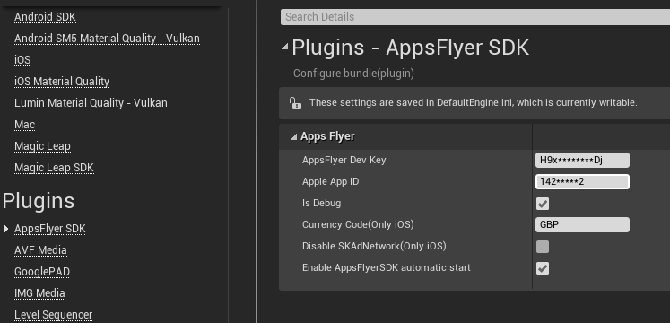

# Unreal Engine 4 AppsFlyer Plugin Guides


## Table of content

- [Init SDK](#init-sdk)
- [Track Event](#inappevent)
- [Set Custom User Id](#customid)
- [DeepLinking](#deeplinking)
    - [Deferred Deep Linking (Get Conversion Data)](#deferred-deep-linking)
    - [Direct Deeplinking](#handle-deeplinking)
    - [Android Deeplink Setup](#android-deeplink)
    - [iOS Deeplink Setup](#ios-deeplink)
- [Demo](#demo)


##  <a id="init-sdk"> Init SDK
    

    
##  <a id="inappevent"> Track Event
    


##  <a id="customid"> Set Custom User ID
    


##  <a id="deeplinking"> Deep Linking
    


#### The 2 Deep Linking Types:
Since users may or may not have the mobile app installed, there are 2 types of deep linking:

1. Deferred Deep Linking - Serving personalized content to new or former users, directly after the installation. 
2. Direct Deep Linking - Directly serving personalized content to existing users, which already have the mobile app installed.

For more info please check out the [OneLink™ Deep Linking Guide](https://support.appsflyer.com/hc/en-us/articles/208874366-OneLink-Deep-Linking-Guide#Intro).

###  <a id="deferred-deep-linking"> 1. Deferred Deep Linking (Get Conversion Data)

Check out the deferred deeplinkg guide from the AppFlyer knowledge base [here](https://support.appsflyer.com/hc/en-us/articles/207032096-Accessing-AppsFlyer-Attribution-Conversion-Data-from-the-SDK-Deferred-Deeplinking-#Introduction)

Code Sample to handle the conversion data:


###  <a id="handle-deeplinking"> 2. Direct Deeplinking
    
When a deeplink is clicked on the device the AppsFlyer SDK will return the link in the [onAppOpenAttribution](https://support.appsflyer.com/hc/en-us/articles/208874366-OneLink-Deep-Linking-Guide#deep-linking-data-the-onappopenattribution-method-) method.


###  <a id="android-deeplink"> Android Deeplink Setup
    
    
    
#### URI Scheme
In your app’s manifest add the following intent-filter to your relevant activity:
```xml 
<intent-filter>
    <action android:name="android.intent.action.VIEW" />
    <category android:name="android.intent.category.DEFAULT" />
    <category android:name="android.intent.category.BROWSABLE" />
    <data android:scheme="your unique scheme" />
</intent-filter>
```


#### App Links
For more on App Links check out the guide [here](https://support.appsflyer.com/hc/en-us/articles/115005314223-Deep-Linking-Users-with-Android-App-Links#what-are-android-app-links).


###  <a id="ios-deeplink"> iOS Deeplink Setup
For more on Universal Links check out the guide [here](https://support.appsflyer.com/hc/en-us/articles/208874366-OneLink-Deep-Linking-Guide#setups-universal-links).
    
Essentially, the Universal Links method links between an iOS mobile app and an associate website/domain, such as AppsFlyer’s OneLink domain (xxx.onelink.me). To do so, it is required to:

1. Configure OneLink sub-domain and link to mobile app (by hosting the ‘apple-app-site-association’ file - AppsFlyer takes care of this part in the onelink setup on your dashboard)
2. Configure the mobile app to register approved domains:

```xml
<?xml version="1.0" encoding="UTF-8"?>
<!DOCTYPE plist PUBLIC "-//Apple//DTD PLIST 1.0//EN" "http://www.apple.com/DTDs/PropertyList-1.0.dtd">
<plist version="1.0">
    <dict>
        <key>com.apple.developer.associated-domains</key>
        <array>
            <string>applinks:test.onelink.me</string>
        </array>
    </dict>
</plist>
```


##  <a id="demo"> Demo
